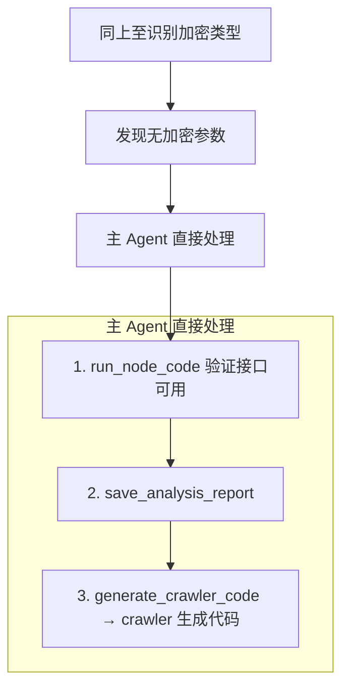
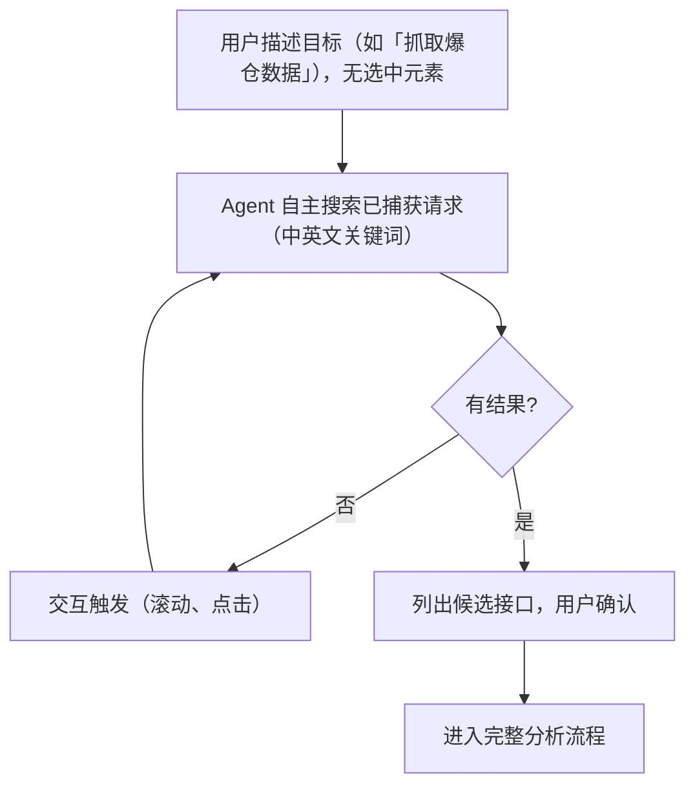
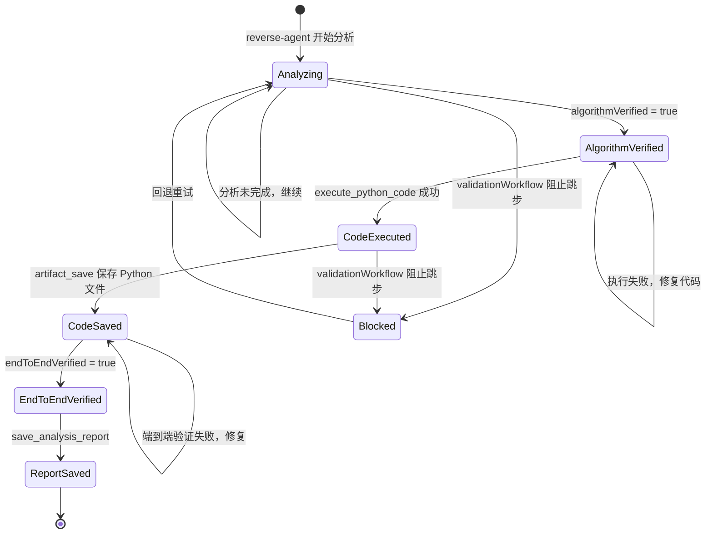

# DeepSpider 产品需求文档

## 1.1 项目概述

DeepSpider 是一个基于 AI Agent + 真实浏览器（Patchright）的智能爬虫工程平台。它不是传统的爬虫框架，而是一个"爬虫 Agent"——用户只需指定目标网站，AI 自动完成：接口定位、加密逆向、Python 代码生成、端到端验证、完整爬虫脚本输出。

核心技术栈：
- AI 引擎：LangChain + LangGraph + Anthropic Claude
- 浏览器：Patchright（反检测 Chromium）+ CDP 协议
- 代码执行：Node.js 沙箱 + Python (uv)
- 存储：文件系统 + SQLite（会话管理）

版本：1.0.0-beta，ESM 模块，Node.js >= 18

## 1.2 核心问题

**目标用户**：爬虫工程师、安全研究员、数据分析师

**用户场景**：
1. 面对一个有加密参数的网站（如请求签名、Cookie 加密），需要逆向分析加密逻辑
2. 需要快速获取某网站的 API 数据，但接口有动态签名
3. 需要生成可运行的 Python 爬虫代码，而不只是分析报告

**核心痛点**：
- 传统逆向流程繁琐：手动找接口 → 手动读混淆代码 → 手动写解密代码 → 手动测试
- 混淆代码可读性差，需要反混淆工具辅助
- 加密算法种类多（AES/MD5/RSA/国密SM系列），人工逐个识别效率低
- 反调试手段（无限debugger、console检测、CDP检测）干扰分析

**DeepSpider 的解决方案**：
- AI 直接理解混淆代码，无需反混淆预处理
- 自动注入 Hook 捕获加密调用的运行时参数
- CDP 拦截器自动记录所有网络请求和脚本
- 反反调试（setSkipAllPauses + 脚本黑盒化）
- 端到端验证确保生成的代码真正可用

## 1.3 产品形态

三种使用方式：
1. **Agent 模式**（核心）：`pnpm run agent https://target.com` — 打开浏览器，AI + 人协同分析
2. **CLI 模式**：`deepspider fetch <url>` — 轻量级 HTTP 请求（TLS 指纹伪装）
3. **MCP 模式**：`pnpm run mcp` — 作为 MCP 服务供 Claude Code 等工具调用

## 1.4 需求范围

**In-Scope（已实现）**：
- 浏览器自动化 + Hook 注入 + CDP 拦截
- 网络请求自动记录与搜索
- JS 脚本捕获与搜索
- 加密算法自动识别（34种模式）
- CDP 断点调试（断点、调用栈、变量查看）
- Node.js / Python 代码执行与验证
- 沙箱隔离执行（isolated-vm）
- 分析报告生成（Markdown + HTML）
- 爬虫代码生成（requests/httpx/Scrapy）
- 浏览器内交互面板（元素选择、聊天、快捷操作）
- 会话持久化（SQLite）与恢复
- TLS 指纹伪装（cycletls）
- 反反调试（setSkipAllPauses + 脚本黑盒化 + 风暴检测）
- 滑块验证码轨迹模拟
- 工作记忆（scratchpad）

**Out-of-Scope / Stub（未完整实现）**：
- 图片验证码 OCR（需要 ddddocr 集成）
- 滑块缺口检测（需要 OpenCV）
- 代理池管理（proxy_test 为 stub）
- 云同步、多用户、Web UI
- 分布式爬取

## 1.5 用户旅程

### 场景一：分析加密接口（完整路径）

```mermaid
flowchart TD
    A["用户启动：pnpm run agent https://target.com"] --> B["浏览器打开，自动注入 Hook，CDP 拦截器开始记录"]
    B --> C["用户在网站操作（登录、翻页等），系统静默记录数据"]
    C --> D["用户点击面板选择按钮(⦿)，选中目标数据元素"]
    D --> E["点击「完整分析并生成爬虫」"]
    E --> F["主 Agent 分析"]

    subgraph main_agent ["主 Agent 分析"]
        F1["1. search_in_responses 搜索选中文本，定位数据来源 API"]
        F2["2. get_request_detail 查看请求详情，识别加密参数"]
        F3["3. get_request_initiator 获取调用栈"]
        F4["4. 委托 reverse-agent（传递 site, requestId, callStack）"]
        F1 --> F2 --> F3 --> F4
    end

    F --> F1
    F4 --> G["reverse-agent 执行"]

    subgraph reverse_agent ["reverse-agent 执行"]
        G1["1. search_in_scripts 搜索加密特征词"]
        G2["2. get_script_source (offset/limit) 分段拉取相关代码"]
        G3["3. AI 直接分析混淆代码，识别加密算法"]
        G4["4. 生成 Python 实现代码"]
        G5["5. execute_python_code 验证代码正确性"]
        G6["6. artifact_save 保存 Python 文件"]
        G1 --> G2 --> G3 --> G4 --> G5 --> G6
    end

    G --> G1
    G6 --> H["主 Agent 继续"]

    subgraph main_agent2 ["主 Agent 后续"]
        H1["7. 端到端验证（运行代码，对比浏览器数据）"]
        H2["8. save_analysis_report 保存报告"]
        H3["9. generate_crawler_code → 用户选择框架"]
        H4["10. 委托 crawler 生成完整爬虫脚本"]
        H1 --> H2 --> H3 --> H4
    end

    H --> H1
    H4 --> I["输出：~/.deepspider/output/{domain}/\ndecrypt.py + crawler.py + analysis.md + report.html"]
```

### 场景二：无加密接口（快速路径）

### 场景三：自主数据搜寻

## 1.6 验证流程（质量门禁）

系统强制两层验证：
1. **算法验证**：reverse-agent 必须完成加密分析（`algorithmVerified`）
2. **端到端验证**：生成的代码必须成功运行并返回目标数据（`endToEndVerified`）
3. **代码保存**：Python 代码必须已保存为文件（`savedPythonCode`）

三项全部通过才允许 `save_analysis_report`。中间件 `validationWorkflow` 硬性阻止跳步。

## 1.7 边缘情况处理

- **源码过大（>10KB）**：禁止全量拉取，必须 search_in_scripts 定位后分段拉取
- **连续超时（3次）**：run_node_code 降级为 5s 短超时探测，提示换用 sandbox_execute
- **子代理超时**：会话持久化 + 自动恢复机制（3分钟内可恢复）
- **上下文膨胀**：主 Agent 100k tokens 触发摘要；子代理 80k tokens 清理旧工具结果（保留最近5条）
- **工具重复调用**：toolGuard 中间件 — 3次警告、5次强警告、8次阻止
- **双工具循环**：A↔B 模式检测 — 2次警告、3次强警告、5次阻止
- **面板无响应**：generate_crawler_code 的 interrupt 60秒超时，自动选择 requests 框架
- **反调试干扰**：setSkipAllPauses 零开销跳过 debugger 语句；风暴模式（1秒内>5次暂停）自动全量跳过3秒
- **无加密场景**：快速路径跳过 reverse-agent，直接验证接口可用性
- **会话恢复**：浏览器打开后检测同域名历史会话，面板弹出"恢复上次分析"按钮
