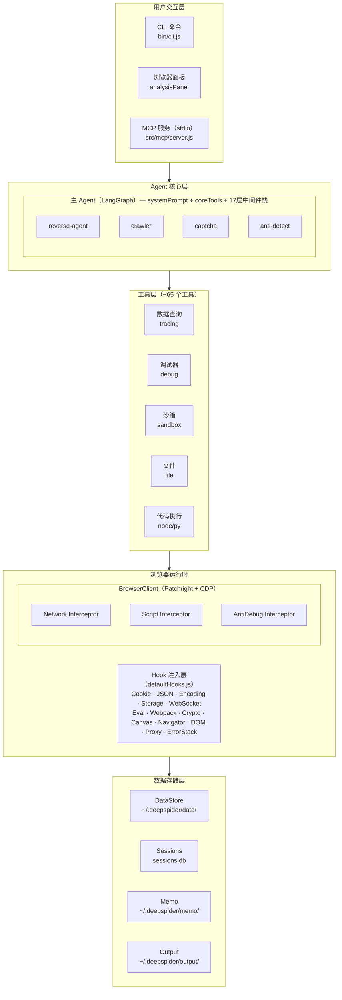
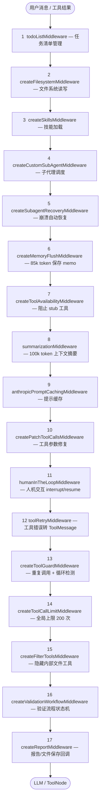
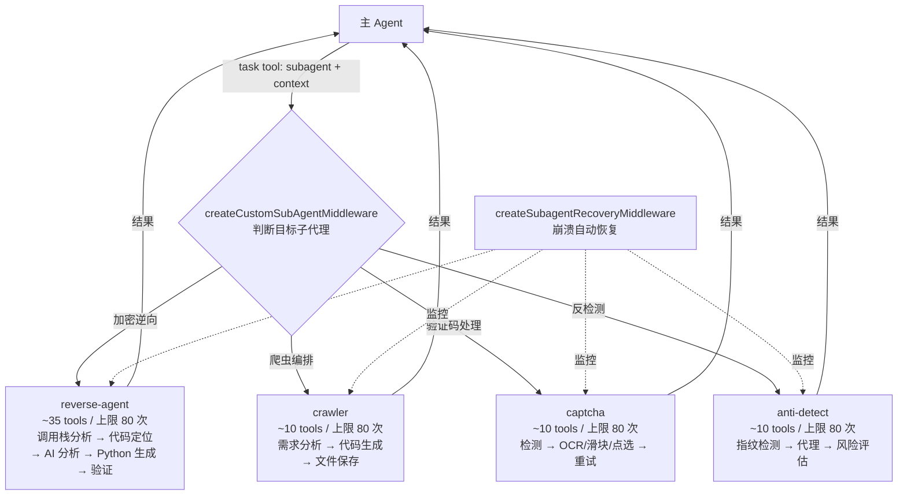
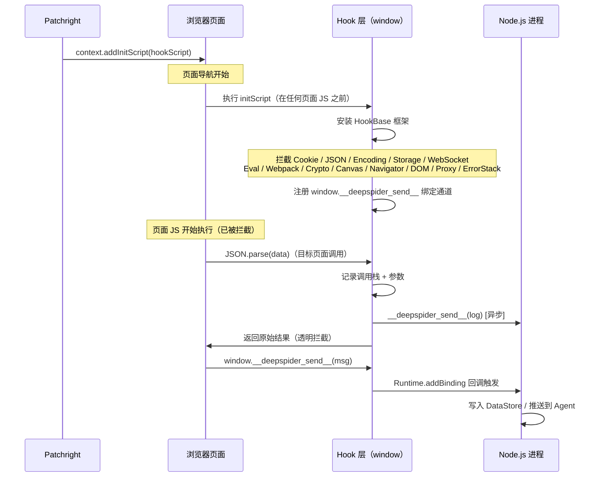

# DeepSpider 技术架构

## 2.1 系统架构总览



## 2.2 Agent 架构

### 2.2.1 主 Agent

使用 `createAgent`（非 `createDeepAgent`）手动组装，以支持自定义 task tool schema。

**LLM 配置**：
- 主模型：`ChatAnthropic`，120s 超时
- 摘要模型：`ChatAnthropic`，无超时限制
- API 补丁：`globalThis.fetch` 拦截 Anthropic API 请求，自动清理 Zod v4 生成的无效 JSON Schema 字段（`$schema`、`propertyNames`、空 `additionalProperties`）

**后端存储**：
- `FilesystemBackend`（`.deepspider-agent/`）或 `StateBackend`
- Checkpointer：`SqliteSaver`（内存模式，可覆盖）

**中间件栈（17层，按注册顺序执行）**：



| 层级 | 中间件 | 作用 |
|------|--------|------|
| 1 | `todoListMiddleware` | 任务清单管理 |
| 2 | `createFilesystemMiddleware` | 文件系统读写（deepagents） |
| 3 | `createSkillsMiddleware` | 技能加载（general + report） |
| 4 | `createCustomSubAgentMiddleware` | 子代理调度（自定义 task 工具） |
| 5 | `createSubagentRecoveryMiddleware` | 子代理崩溃自动恢复 |
| 6 | `createMemoryFlushMiddleware` | 85k token 提醒保存 memo |
| 7 | `createToolAvailabilityMiddleware` | 阻止 stub 工具调用 |
| 8 | `summarizationMiddleware` | 100k token 触发上下文摘要 |
| 9 | `anthropicPromptCachingMiddleware` | Anthropic 提示缓存 |
| 10 | `createPatchToolCallsMiddleware` | 工具调用参数修复 |
| 11 | `humanInTheLoopMiddleware` | 人机交互（interrupt/resume） |
| 12 | `toolRetryMiddleware` | 工具错误 → ToolMessage（不重试） |
| 13 | `createToolGuardMiddleware` | 重复调用检测 + 循环检测 |
| 14 | `createToolCallLimitMiddleware(200)` | 全局工具调用上限 200 次 |
| 15 | `createFilterToolsMiddleware` | 隐藏 write_file/read_file 等 |
| 16 | `createValidationWorkflowMiddleware` | 验证流程状态机 |
| 17 | `createReportMiddleware` | 报告/文件保存事件回调 |

**核心工具集（coreTools）**：
- AI 工具：`generate_full_crawler`
- HTTP：`smart_fetch`, `http_fetch`
- 浏览器生命周期：`launch_browser`, `navigate_to`, `browser_close`, `add_init_script`, `clear_cookies`
- 面板交互：`get_pending_analysis`, `get_pending_chat`, `send_panel_message`, `start_selector`, `send_panel_choices`, `send_panel_confirm`
- 数据查询（最小集）：`get_site_list`, `get_request_list`, `search_in_responses`, `get_request_detail`, `get_request_initiator`
- 报告：`save_analysis_report`
- 文件：`artifact_save/load/edit/glob/grep`
- 代码执行：`run_node_code`, `execute_python_code`
- 工作记忆：`save_memo`, `load_memo`, `list_memo`
- 爬虫生成：`generate_crawler_code`, `delegate_crawler_generation`
- 页面交互：`click_element`, `scroll_page`, `fill_input`, `get_interactive_elements`, `get_page_info`, `hover_element`, `press_key`
- 经验进化：`evolve_skill`

### 2.2.2 子代理体系

| 子代理 | 工具数 | 核心能力 | 工具调用上限 |
|--------|--------|----------|-------------|
| reverse-agent | ~35 | 加密逆向：调用栈分析→代码定位→AI分析→Python生成→验证 | 80 |
| crawler | ~10 | 爬虫编排：需求分析→代码生成→文件保存 | 80 |
| captcha | ~10 | 验证码：检测→OCR/滑块/点选→重试 | 80 |
| anti-detect | ~10 | 反检测：指纹检测→代理→风险评估 | 80 |



子代理公共中间件（createBaseMiddleware）：
1. `toolRetryMiddleware`（maxRetries=0）
2. `createFilterToolsMiddleware`
3. `createToolCallLimitMiddleware(80)`
4. `contextEditingMiddleware`（80k token 触发，保留最近 5 条工具结果，排除 save_memo）
5. `createSkillsMiddleware`

子代理通过主 Agent 的 `task` 工具调度，task schema 支持：
- `context`：结构化 KV 参数（site, requestId, targetParam, url）
- `thread_id` + `resume`：会话恢复

### 2.2.3 会话管理

- 每个域名一个 SQLite 线程（`deepspider-{domain}-{timestamp}`）
- 检查点存储在 `~/.deepspider/checkpoints.db`（WAL 模式）
- 会话元数据存储在 `~/.deepspider/sessions.db`
- 7 天自动过期
- 启动时检测同域名历史会话，面板弹出恢复选项

## 2.3 浏览器运行时

### 2.3.1 BrowserClient

基于 Patchright（反检测 Chromium fork）。

**启动参数**：
- `--disable-blink-features=AutomationControlled`
- `--disable-web-security`
- `--ignore-certificate-errors`
- 支持持久化用户数据（`launchPersistentContext`）

**CDP 会话管理**：
- `getCDPSession()` 带健康检查（`Runtime.evaluate('1')` + 3s 超时）
- 5s 节流窗口避免频繁重建
- 页面切换时自动重建 CDP 会话

**消息桥接**：
- `Runtime.addBinding('__deepspider_send__')` 注册 JS→Node 通道
- 面板/Hook 通过 `window.__deepspider_send__(JSON.stringify(data))` 发送消息
- 消息带 `__ds__: true` 标记，Hook 层自动过滤不记录

### 2.3.2 CDP 拦截器

三个拦截器协同工作：

**NetworkInterceptor**：
- 域：`Network.enable`
- 只记录 XHR/Fetch 请求（过滤 Document/Image/Stylesheet 等）
- 二进制内容替换为 `[Binary: type, N bytes]`
- 文本响应截断到 50KB
- WebSocket 帧记录：每连接 2帧/秒 限流，最大 50KB/帧

**ScriptInterceptor**：
- 域：`Debugger.enable`
- 监听 `Debugger.scriptParsed`
- 有 URL 的脚本：获取源码 + 存储到 DataStore（截断 2MB）
- 无 URL 的脚本（eval/new Function）：仅通知 AntiDebugInterceptor 检查
- 通过 `onSource` 回调与 AntiDebugInterceptor 共享源码（避免重复 CDP 调用）

**AntiDebugInterceptor**：
- 主策略：`Debugger.setSkipAllPauses({ skip: true })` — 零开销跳过所有 debugger 语句
- 辅助策略：检测含 `debugger` 关键词的脚本 → `Debugger.setBlackboxedRanges` 黑盒化整个脚本
- 风暴检测：1秒内 >5 次暂停事件 → 自动启用全量跳过模式 3 秒
- 手动断点不受影响（检查 `reason === 'breakpoint'`）

### 2.3.3 Hook 注入

通过 `context.addInitScript()` 在页面 JS 执行前注入。三种模式：



| 模式 | 包含内容 |
|------|----------|
| `none` | 仅数据收集器 + 面板 UI |
| `minimal` | HookBase 框架 + 收集器 + 面板 |
| `full` | 全部 14 类 Hook |

**14 类 Hook**：

| Hook | 拦截目标 | 日志类型 |
|------|----------|---------|
| Cookie | `document.cookie` getter/setter | cookie |
| JSON | `JSON.parse/stringify`（≥50字符） | json |
| Encoding | `atob/btoa/TextEncoder/TextDecoder` | encoding |
| Storage | `localStorage/sessionStorage`（排除 `deepspider_` 前缀） | storage |
| WebSocket | `WebSocket` 构造函数 + 事件 | websocket |
| Eval | `eval/Function/setTimeout(string)/setInterval` + debugger 绕过 | eval |
| Webpack | `webpackJsonp/webpackChunk/__webpack_require__` + 自动库识别 | - |
| Crypto | CryptoJS/JSEncrypt/SM-Crypto/Forge/jsrsasign/WebCrypto.subtle | crypto |
| Canvas | `toDataURL/getImageData` | env |
| Navigator | `userAgent/platform/language/webdriver` 等 getter | env |
| DOM | `getElementById/querySelector` 等 | dom |
| Proxy | `new Proxy()` + trap 调用 | - |
| ErrorStack | `Error.prototype.stack` 过滤内部帧 | - |

**反检测措施**：
- `Function.prototype.toString` 通过 WeakMap 返回原始源码
- `Object.getOwnPropertyDescriptor` 返回干净描述符
- `Object.keys/getOwnPropertyNames` 隐藏 `__deepspider__` 属性
- Error stack 过滤所有含 `deepspider` 的帧

**Webpack 自动识别**：
- 检测 CryptoJS（AES/enc.Utf8/MD5/SHA256）
- 检测 JSEncrypt（prototype.encrypt/decrypt）
- 检测 SM-Crypto（doEncrypt/doDecrypt）
- 检测 Forge（cipher/md/util/pki.rsa）
- 启动后持续扫描 10 秒（每 200ms 一次）

**日志系统**：
- 每类 API 限制 50 条日志（防爆）
- 调用栈捕获（configurable depth=5）
- 请求上下文关联（`startRequest/endRequest/linkCrypto`）
- 查询 API：`getLogs/getAllLogs/searchLogs/traceValue/correlateParams`

## 2.4 数据存储

### 2.4.1 DataStore（文件系统）

```
~/.deepspider/
├── data/
│   ├── index.json                          # 全局站点列表
│   └── sites/
│       └── {hostname}/
│           ├── index.json                  # 站点索引（responses[], scripts[], crypto[]）
│           ├── GET_{path}_{params}.json    # 请求记录
│           └── script_{hash}.js           # 脚本源码
├── memo/                                   # 工作记忆
│   └── {key}.txt
├── output/                                 # 输出目录
│   ├── reports/{domain}/                   # 分析报告
│   │   ├── analysis.md
│   │   ├── report.html
│   │   ├── decrypt.py
│   │   └── crawler.py
│   ├── screenshots/                        # 截图
│   └── unpacked/                           # 解包结果
├── store/                                  # 知识库
├── config/
│   └── settings.json                       # 配置文件
├── sessions.db                             # 会话 SQLite
├── checkpoints.db                          # LangGraph 检查点
└── browser-data/                           # 持久化浏览器数据（按需）
```

**特性**：
- 文件级锁（per-site promise 队列，30s 超时）
- 内容去重（MD5 hash of `{url}|{method}|{body}`）
- 内存搜索索引（增量填充）
- 自动清理：7 天过期、100MB/站点、500MB 总量、1 小时清理间隔

### 2.4.2 配置系统

三层优先级：环境变量 > 配置文件 > 默认值

| 配置项 | 环境变量 | 默认值 |
|--------|---------|--------|
| apiKey | DEEPSPIDER_API_KEY | '' |
| baseUrl | DEEPSPIDER_BASE_URL | 'https://api.openai.com/v1' |
| model | DEEPSPIDER_MODEL | 'gpt-4o' |
| aiProvider | DEEPSPIDER_AI_PROVIDER | 'anthropic' |
| aiModel | DEEPSPIDER_AI_MODEL | '' |
| persistBrowserData | DEEPSPIDER_PERSIST_BROWSER | false |

## 2.5 加密识别引擎

34 个正则模式，覆盖：

| 分类 | 模式 |
|------|------|
| 哈希 | md5_sign, sha1_hash, sha256_hash, sha512_hash |
| 国密 | sm2_sign, sm3_hash, sm4_encrypt |
| AES | aes_cbc, aes_ecb, aes_gcm, aes_cfb, aes_ofb, aes_ctr |
| DES | des_encrypt, triple_des |
| HMAC | hmac_md5, hmac_sha1, hmac_sha256 |
| RSA | rsa_encrypt |
| 其他 | rc4_encrypt, pbkdf2, blowfish, crc32, bcrypt_hash |
| 编码 | base64_encode, base64_decode, url_encode, url_decode, hex_encode |
| 工具 | timestamp_sign, uuid_generate, random_string, json_stringify, params_sort |

每个模式包含：`detect`（正则）、`template`（Python 代码模板）、`confidence`（0.8-0.95）。

`getEncryptionHints(code)` 返回匹配的模式名列表，作为 LLM 分析的辅助提示。

## 2.6 MCP 服务

- 暴露 `coreTools`（非 `allTools`），排除危险工具（`sandbox_execute`、`run_node_code`）
- stdio 传输
- 内联 `zodToJsonSchema` 转换器（避免依赖完整 zod-to-json-schema 库）
- 处理 `ListTools` 和 `CallTool` 请求
