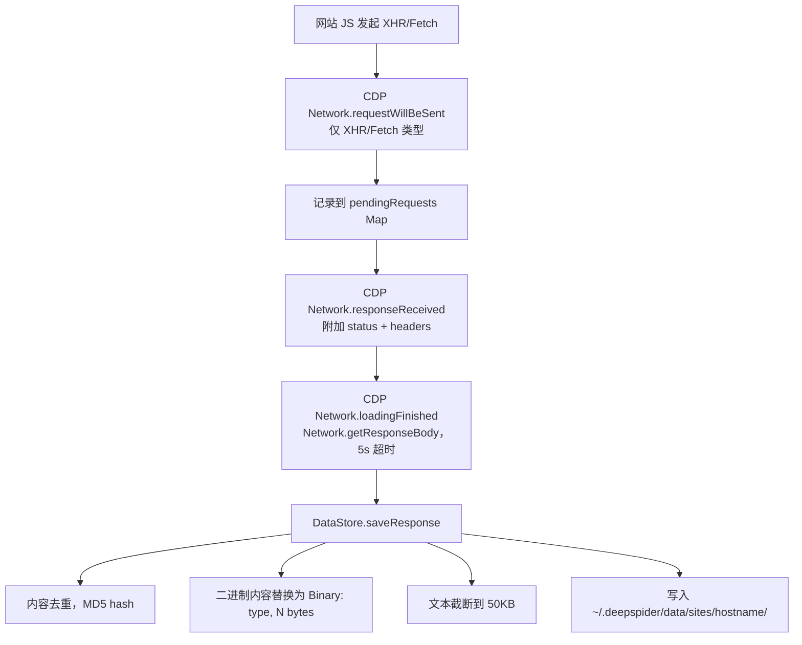
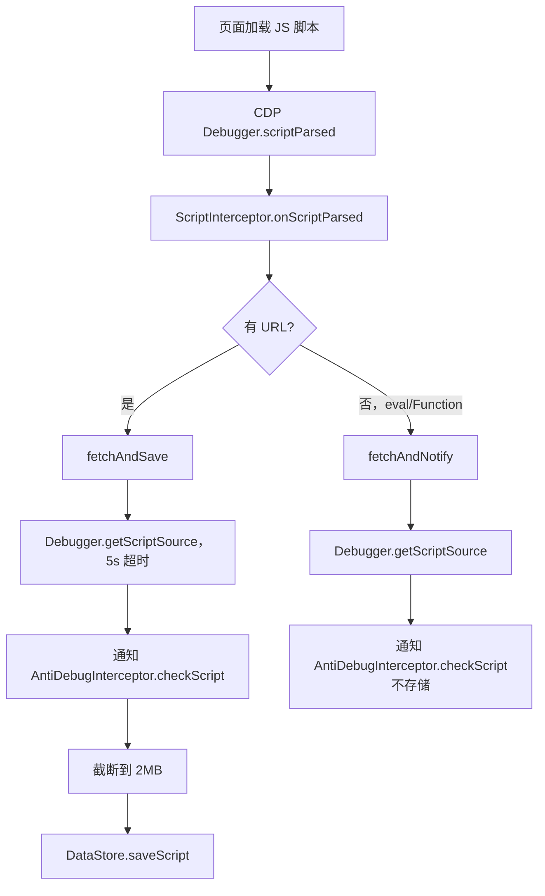
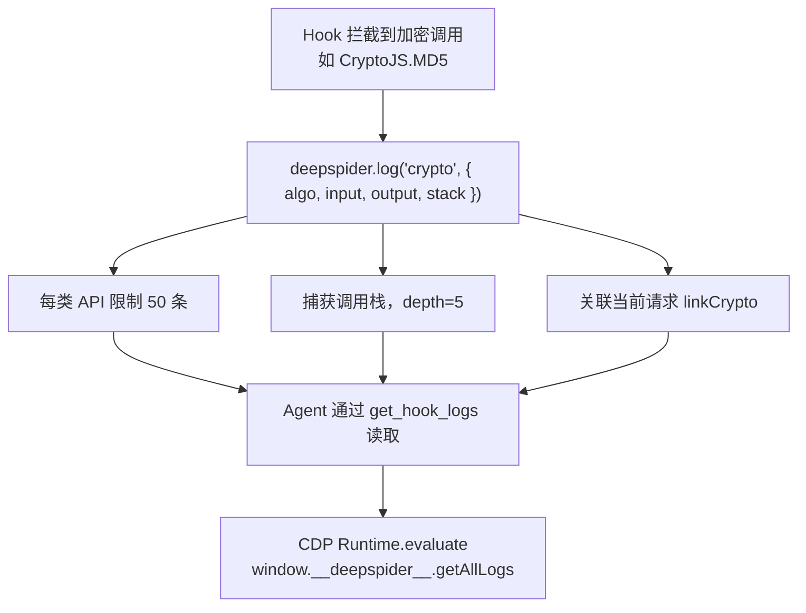
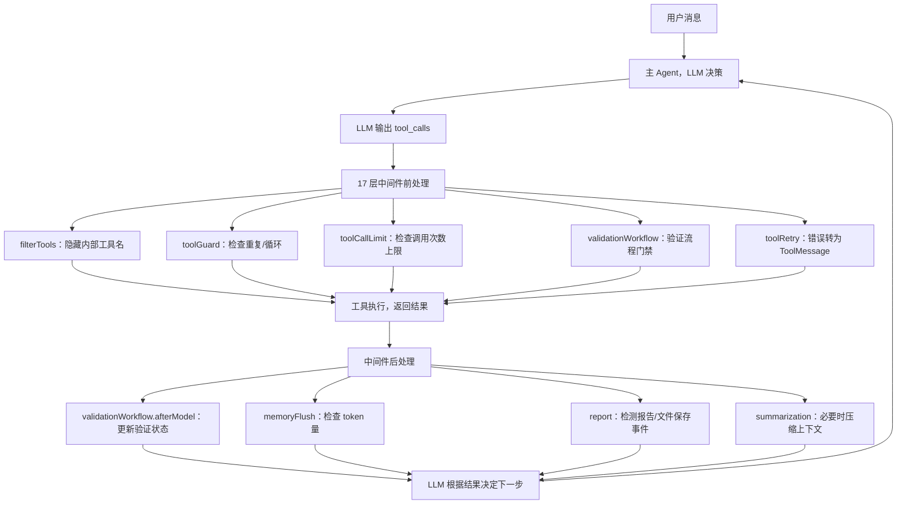
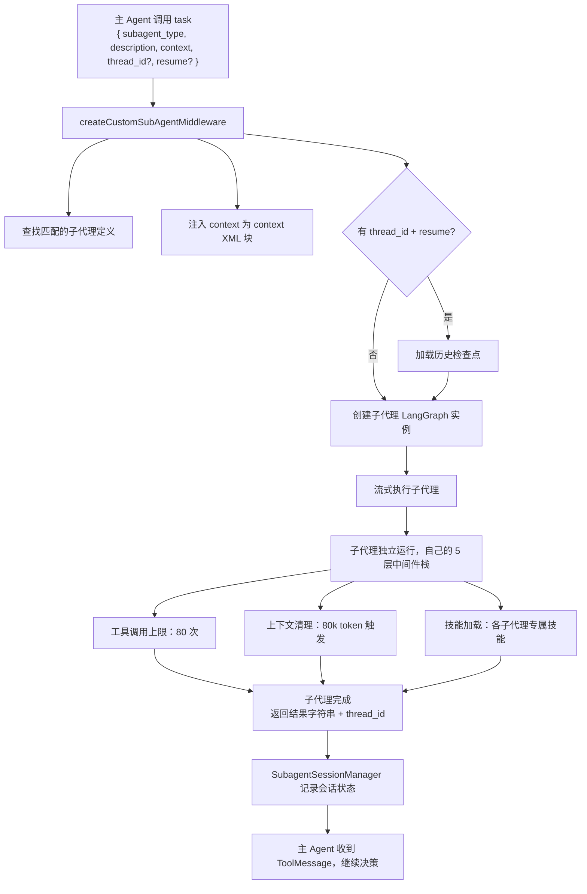

# DeepSpider 交互与数据流

## 4.1 CLI 命令路由

入口：`bin/cli.js`，通过 `process.argv[2]` 的 switch 语句路由。所有模块动态 `import()`。

```
deepspider --version        → src/cli/commands/version.js
deepspider --help           → src/cli/commands/help.js
deepspider config <sub>     → src/cli/commands/config.js
deepspider update           → src/cli/commands/update.js
deepspider fetch <url>      → src/cli/commands/fetch.js
deepspider <url>            → src/agent/run.js（Agent 模式）
deepspider                  → src/agent/run.js（纯交互模式）
```

### config 子命令

| 子命令 | 功能 |
|--------|------|
| `config list` | 列出所有配置项、值、来源（env/file/default）。apiKey 脱敏显示 |
| `config get <key>` | 获取单个配置项 |
| `config set <key> <val>` | 设置配置项（布尔值自动转换：'true'/'1' → true）。如果同名环境变量存在则警告 |
| `config reset` | 删除 settings.json |
| `config path` | 显示配置文件路径 |

### fetch 命令

使用 `cycletls` 发送 TLS 指纹伪装请求：
- 硬编码 Chrome 120 JA3 指纹 + User-Agent
- 输出状态码和响应体字节数
- 状态码 ≥ 400 时建议使用 Agent 模式

### update 命令

1. 从 npm registry 获取最新版本
2. 检测是全局安装还是本地安装
3. 全局安装：确认后执行 `npm install -g deepspider@latest`
4. 本地安装：输出手动更新指令

## 4.2 Agent 模式启动流程

```
pnpm run agent [--debug] [--persist] [--resume] [--stealth] [--raw] [--no-hooks] [--no-cdp] [url]
```

### 启动参数

| 参数 | 效果 |
|------|------|
| `url` | 启动浏览器并导航到该 URL |
| `--persist` | 使用持久化浏览器数据目录（保留 Cookie/登录状态） |
| `--resume` | 恢复最近的会话 |
| `--debug` | 启用调试日志 |
| `--stealth` | 最小化 Hook（`hookMode: 'minimal'`） |
| `--raw` | 完全关闭 Hook 和 CDP 拦截器 |
| `--no-hooks` | 仅关闭 Hook |
| `--no-cdp` | 仅关闭 CDP 拦截器 |
| 无 url | 纯交互模式，不启动浏览器 |

### 初始化顺序

```
1. 解析命令行参数
2. ensureConfig() — 检查 apiKey/baseUrl/model
3. initDirectories() — 创建 ~/.deepspider/ 目录结构
4. 创建 SQLite checkpointer + session store
5. 创建 BrowserClient
6. createDeepSpiderAgent() — 组装 17 层中间件栈
7. 如有 URL：
   a. browser.launch() — 启动 Patchright
   b. 设置 onMessage 回调（浏览器 → Agent）
   c. browser.navigate(url)
   d. 检测同域名历史会话 → 面板弹出恢复选项
8. 启动 readline 循环（CLI 交互）
```

## 4.3 浏览器面板

### 面板结构

400×70vh 固定面板（`position: fixed; right: 20px; top: 20px; z-index: 2147483640`），包含：

```
┌─────────────────────────────────┐
│ DeepSpider  ● ⦿ − ×            │  ← 头部：标题、状态灯、选择/最小化/关闭按钮
├─────────────────────────────────┤
│ [查看分析报告]                   │  ← 报告按钮（有报告时显示）
├─────────────────────────────────┤
│                                 │
│  消息历史区域                    │  ← 可滚动的消息列表
│  （Markdown 渲染）               │
│                                 │
├─────────────────────────────────┤
│ [tag1] [tag2] ×                 │  ← 已选中元素标签
├─────────────────────────────────┤
│ ┌─────────────────────────┐ [发] │  ← 输入框 + 发送按钮
│ └─────────────────────────┘     │
├─────────────────────────────────┤
│ [追踪] [加密] [完整分析] [提取]  │  ← 快捷操作按钮
└─────────────────────────────────┘
```

### 消息协议

所有消息通过 CDP `Runtime.addBinding('__deepspider_send__')` 桥接，带 `__ds__: true` 标记。

**面板 → Agent（上行消息）**：

| type | 触发场景 | 数据 |
|------|----------|------|
| `chat` | 用户发送文本 | `{text, elements?[], url?}` |
| `analysis` | 快捷操作按钮 | `{action: 'trace'/'decrypt'/'full'/'extract', elements[], text, url}` |
| `choice` | 用户点击选项卡片 | `{value: string}` |
| `confirm-result` | 确认对话框 | `{confirmed: boolean}` |
| `resume` | 恢复历史会话 | `{threadId: string}` |
| `open-file` | 点击文件路径 | `{path: string}` |

**Agent → 面板（下行消息）**：

| type | 渲染效果 |
|------|----------|
| `text` | 助手消息气泡（Markdown 渲染） |
| `user` | 用户消息气泡（蓝色右对齐） |
| `system` | 系统通知（居中灰色） |
| `choices` | 问题 + 可点击选项卡片 |
| `confirm` | 问题 + 确认/取消按钮 |
| `resume-available` | 域名 + 时间 + 消息数 + "恢复上次分析"按钮 |
| `file-saved` | 文件图标 + 可点击路径（py/report/其他） |

### 元素选择模式

1. 用户点击面板 ⦿ 按钮 → `startSelector()`
2. 光标变为十字准线
3. 鼠标悬停元素：蓝色高亮覆盖层（`#63b3ed`）+ 信息提示框
4. 点击元素：添加到选中列表（不退出选择模式）
5. 按 ESC 退出选择模式
6. 支持 iframe 内元素选择（通过 `postMessage` 通信）

### 面板 API

面板通过 `window.deepspider.*` 暴露 API，Agent 通过 CDP `Runtime.evaluate` 调用：

```javascript
showPanel()             hidePanel()
addMessage(role, content)
addStructuredMessage(type, data)
updateLastMessage(role, content)
renderMessages()        clearMessages()
startSelector()         stopSelector()
showReport(pathOrContent, isHtml)
setBusy(busy)          minimize()          maximize()
getSelectedElements()   clearSelectedElements()
```

### 状态持久化

- `deepspider_chat_messages`：消息历史 → sessionStorage
- `deepspider_selected_elements`：已选中元素 → sessionStorage

## 4.4 数据流总览

### 4.4.1 网络请求记录流



### 4.4.2 脚本捕获流



### 4.4.3 Hook 日志流



### 4.4.4 Agent 工具调用流



### 4.4.5 子代理调度流



## 4.5 StreamHandler

`StreamHandler` 封装 `agent.streamEvents`，处理：

- 工具调用显示（实时输出到终端/面板）
- HITL `interrupt` 处理（暂停→等待→恢复）
- 150s 空闲超时检测
- API/schema 错误重试（`RetryManager`）
- DeepSeek 模型输出清理（去除 `｜DSML｜` 标记）
- 2 分钟无工具调用干预（提醒 Agent 不要空转）

## 4.6 PanelBridge

所有 Agent → 浏览器通信通过 `PanelBridge`：

- CDP `Runtime.evaluate` + 3s 超时（防止 debugger 暂停导致死锁）
- `waitForPanel(5s)`：等待面板初始化完成
- `sendMessage(type, data)`：发送结构化消息
- `sendBatch(messages)`：批量发送
- `setBusy(bool)`：显示/隐藏加载状态
- `removeLastAssistantMessage()`：更新前删除旧消息
