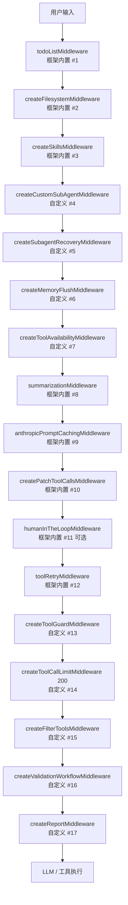
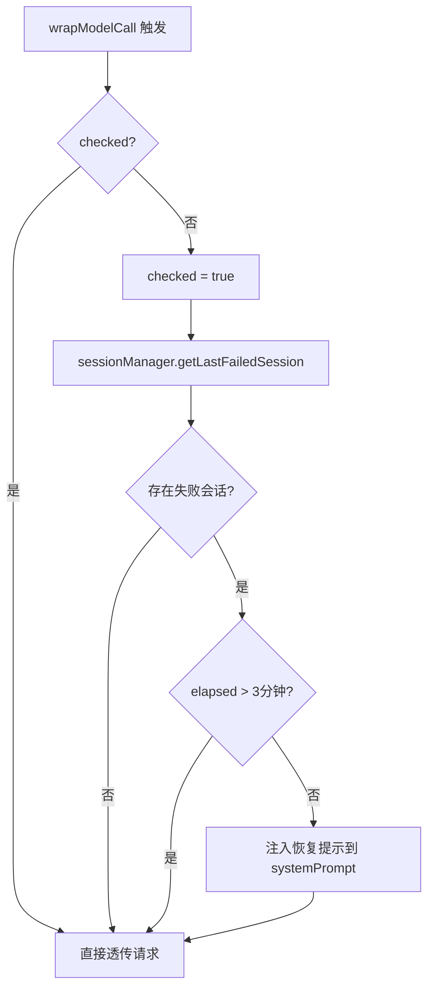
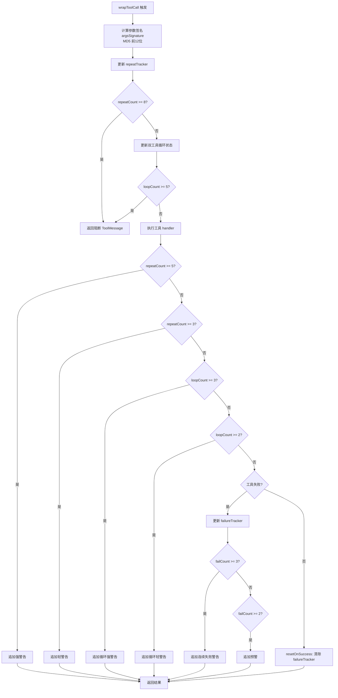
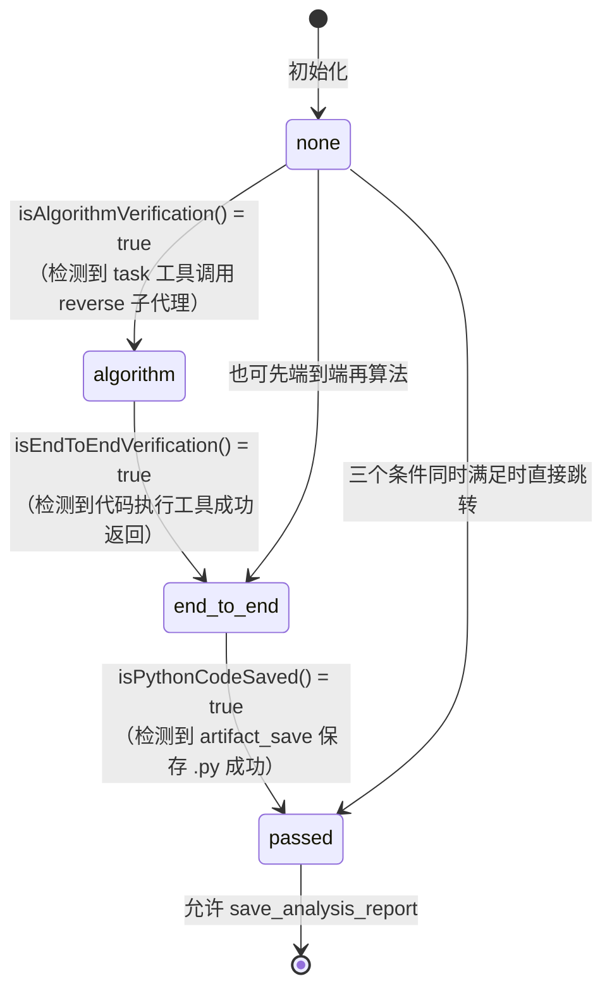
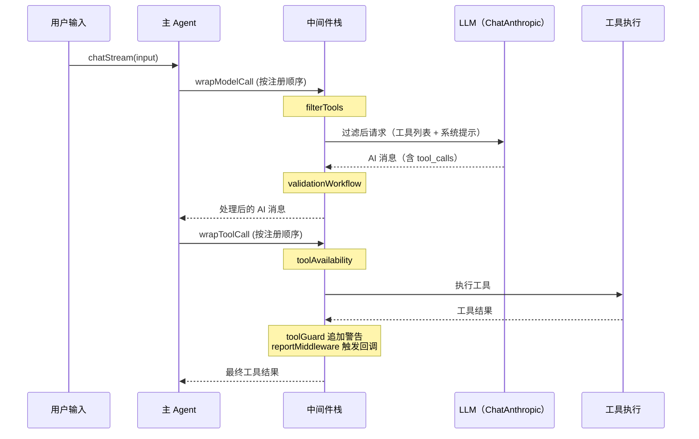
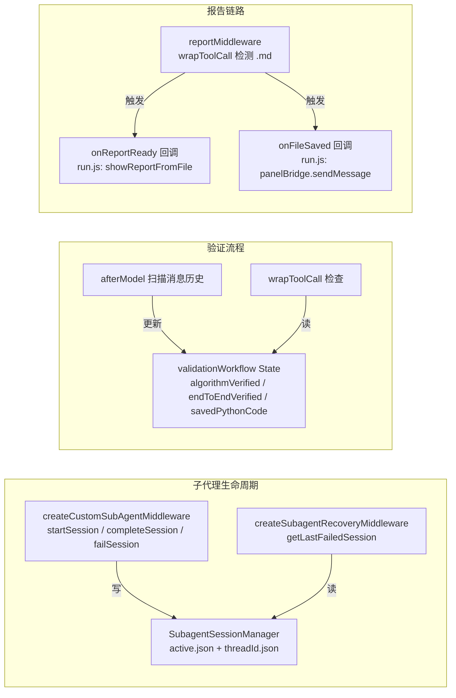

# DeepSpider 中间件详解

本文档详细描述 DeepSpider Agent 系统中所有自定义中间件的工作机制。框架内置中间件（`todoListMiddleware`、`summarizationMiddleware` 等）不在此范围内，仅作管道位置说明。

---

## 1. 中间件管道总览

### 1.1 主 Agent 中间件执行顺序



> 注：LangGraph 中间件的执行语义是"包裹"关系，外层注册靠前的中间件先处理请求（before/wrap），后处理响应（after）。因此编号 1 的中间件在 `wrapModelCall` 时最先被调用，在 `afterModel` 时最后被调用。

### 1.2 子代理公共中间件（createBaseMiddleware）

每个子代理在通过 `createSubagent` 创建时自动注入：

```
toolRetryMiddleware（maxRetries=0）
→ createFilterToolsMiddleware
→ createToolCallLimitMiddleware（80）
→ contextEditingMiddleware（80k token 触发）
→ createSkillsMiddleware（按子代理指定 skills）
```

---

## 2. 各中间件详情

### 2.1 createCustomSubAgentMiddleware

**文件**：`src/agent/middleware/subagent.js`

**作用**：替换 deepagents 内置子代理调度器，扩展 `task` 工具 schema，支持结构化 `context` 传递和会话恢复。

**Hook 点**：`wrapModelCall`（注入系统提示）+ `tools`（注册增强版 task 工具）

**触发条件**：主 Agent 每次调用 LLM 时（`wrapModelCall`）；主 Agent 调用 `task` 工具时（工具本身处理）。

**行为描述**：

1. 在 `wrapModelCall` 中，将 `TASK_SYSTEM_PROMPT`（来自 deepagents）加上 context 使用说明拼接到系统消息末尾。
2. 注册增强版 `task` 工具，schema 比内置版本多三个字段：
   - `context`（`z.object({}).passthrough().optional()`）：KV 结构化上下文
   - `thread_id`（`z.string().optional()`）：子代理会话 ID
   - `resume`（`z.boolean().optional()`）：恢复标志
3. 调用 `task` 工具时：
   - 生成或复用 `threadId`（格式：`{subagent_type}-{Date.now()}-{随机7位}`）
   - 通过 `sessionManager.startSession()` 写入会话文件
   - 若 `context` 非空，拼接 `<context>...</context>` 块追加到 `description` 末尾
   - 以 `HumanMessage` 作为子代理初始消息，通过 `configurable.thread_id` 传递 checkpoint 线程
   - 成功后通过 `sessionManager.completeSession()` 更新状态；失败时通过 `sessionManager.failSession()` 记录
4. 返回结果时通过 `returnCommandWithStateUpdate` 构造 `Command` 对象，将子代理 state（排除 `messages/todos/structuredResponse/skillsMetadata/memoryContents`）传播回主 Agent，并在 ToolMessage 末尾追加 `TRUST_SIGNAL`（阻止主 Agent 重复读取子代理已保存的文件）和 `[thread_id: ...]`。

**状态管理**：无独立 stateSchema；子代理的 state 字段通过 `filterStateForSubagent` 过滤后回写主 Agent state。

**关键常量**：

| 常量 | 值 |
|------|----|
| `EXCLUDED_STATE_KEYS` | `messages, todos, structuredResponse, skillsMetadata, memoryContents` |
| thread_id 格式 | `{subagent_type}-{timestamp}-{7位随机}` |

**与其他中间件的交互**：
- 写入 `sessionManager`，被 `createSubagentRecoveryMiddleware` 读取
- 子代理内部运行 `createBaseMiddleware`（含 `createFilterToolsMiddleware` + `createToolCallLimitMiddleware(80)`）

---

### 2.2 createSubagentRecoveryMiddleware

**文件**：`src/agent/middleware/subagentRecovery.js`

**作用**：检测上一轮运行中失败（超时或崩溃）的子代理会话，在下一次主 Agent 调用 LLM 时自动注入恢复指令。

**Hook 点**：`wrapModelCall`

**触发条件**：主 Agent 第一次调用 LLM 时（通过 `checked` 标志保证只执行一次）。

**行为描述**：



恢复提示内容（注入为字符串拼接）：
```
[自动恢复] 立即调用 task({ subagent_type: '{type}', thread_id: '{id}', resume: true, description: '继续之前的任务' })
```

**状态管理**：闭包变量 `checked`（布尔），中间件实例生命周期内只检查一次。

**关键阈值**：

| 阈值 | 值 | 来源 |
|------|----|------|
| 恢复时间窗口 | 3 分钟（180000ms） | `subagentRecovery.js:23` |
| 执行次数限制 | 1 次（checked 标志） | `subagentRecovery.js:10` |

> `getLastFailedSession()` 实际在 `subagentSessionManager.js` 中实现：读取 `active.json`，如果对应会话状态为 `running` 且 `elapsed > RECOVERY_THRESHOLD`（3 分钟），则认为该会话超时需要恢复。

**与其他中间件的交互**：
- 依赖 `SubagentSessionManager`（`sessionManager` 单例）读取失败会话
- 与 `createCustomSubAgentMiddleware` 配合：后者写会话，此中间件读会话

---

### 2.3 createMemoryFlushMiddleware

**文件**：`src/agent/middleware/memoryFlush.js`

**作用**：在 summarization 触发前（85k token），提前注入 SystemMessage 提醒 Agent 使用 `save_memo` 保存关键进度。

**Hook 点**：`beforeModel`

**触发条件**：`countTokensApproximately(state.messages) >= 85000` 且尚未提醒过（`flushed === false`）。

**行为描述**：

- 每次 `beforeModel` 计算当前消息列表的近似 token 数。
- token 数骤降到 42500 以下（即 85000 × 0.5）时，认为 summarization 已执行，重置 `flushed = false`，以便下次到达阈值时再次提醒。
- 达到阈值时，向 `state.messages` 末尾追加一条 `SystemMessage`，内容提示保存分析目标、关键参数和下一步计划。
- 注入后设 `flushed = true`，防止同一轮连续触发多次。

**提醒文本**（注入到 SystemMessage）：

```
上下文即将被压缩（当前接近 token 上限）。
请立即使用 save_memo 工具保存以下关键信息，否则压缩后将丢失：
1. 当前分析目标和已完成的步骤
2. 已发现的关键参数、加密逻辑、请求链路
3. 下一步计划

保存后继续正常工作。
```

**状态管理**：闭包变量 `flushed`（布尔）。

**关键阈值**：

| 阈值 | 值 |
|------|----|
| `FLUSH_THRESHOLD` | 85000 token |
| 重置触发点 | `FLUSH_THRESHOLD * 0.5`（42500 token） |

**与其他中间件的交互**：
- 在 `summarizationMiddleware`（第 8 层，100k token 触发）之前执行，作为预警层

---

### 2.4 createToolAvailabilityMiddleware

**文件**：`src/agent/middleware/toolAvailability.js`

**作用**：拦截已知不可用（stub 实现或缺少依赖）的工具调用，直接返回友好错误，避免 Agent 获得无意义的结果。

**Hook 点**：`wrapToolCall`

**触发条件**：被调用的工具名在 `UNAVAILABLE_TOOLS` 字典中。

**当前不可用工具清单**：

| 工具名 | 原因 |
|--------|------|
| `captcha_ocr` | 需要集成 OCR 服务（ddddocr 或打码平台），当前为占位实现 |
| `captcha_slide_detect` | 需要集成缺口检测算法（OpenCV），当前为占位实现 |
| `proxy_test` | 缺少依赖 https-proxy-agent，无法测试代理 |

**行为描述**：匹配到不可用工具时，跳过真实工具调用，直接返回：
```json
{
  "success": false,
  "error": "工具 {name} 当前不可用：{reason}。请使用其他策略完成任务。"
}
```

**状态管理**：无状态。

**与其他中间件的交互**：
- 在 `summarizationMiddleware` 之前执行，确保不可用工具不会产生无意义的对话历史

---

### 2.5 createToolGuardMiddleware

**文件**：`src/agent/middleware/toolGuard.js`

**作用**：检测并干预三类工具调用异常：重复调用、双工具循环、连续失败，通过警告追加和硬阻断防止 Agent 陷入死循环。

**Hook 点**：`wrapToolCall`

**触发条件**：每次工具调用都经过此中间件。

**行为描述**：



**参数签名**：`argsSignature(toolCall)` 对参数 JSON（key 排序）计算 MD5，取前 12 位十六进制。

**双工具循环检测算法**：
- `lastCall`：记录上一次调用的 `{name, sig}`
- 当当前工具名与 `lastCall.name` 不同时，计算规范化 pair key：`pairKey(A, sigA, B, sigB)`，将两个工具名和签名按字典序排列，避免 A→B 与 B→A 被视为不同模式
- `loopKey === key` 时 `loopCount++`；key 变化时重置为 1
- 同一工具连续调用（name 相同）不更新 loopCount，也不重置

**阈值配置**（`DEFAULTS`）：

| 参数 | 值 | 说明 |
|------|----|------|
| `maxConsecutiveFailures` | 3 | 连续失败追加强警告阈值 |
| `warnAfter` | 2 | 连续失败追加预警阈值 |
| `resetOnSuccess` | `true` | 成功后重置失败计数 |
| `repeatWarnAt` | 3 | 重复调用轻警告阈值 |
| `repeatStrongWarnAt` | 5 | 重复调用强警告阈值 |
| `repeatBlockAt` | 8 | 重复调用硬阻断阈值 |
| `loopWarnAt` | 2 | 双工具循环轻警告阈值（轮数） |
| `loopStrongWarnAt` | 3 | 双工具循环强警告阈值 |
| `loopBlockAt` | 5 | 双工具循环硬阻断阈值 |

**状态管理**：
- `failureTracker`：`Map<toolName, {count}>`，按工具名追踪连续失败次数
- `repeatTracker`：`Map<toolName, {sig, count}>`，按工具名追踪相同参数重复次数
- `lastCall`：`{name, sig}` 或 `null`，上一次调用信息
- `loopCount`：当前循环轮数
- `loopKey`：当前被追踪的规范化 pair key

所有状态通过闭包持有，不写入 Agent state。假设子代理串行调度（deepagents 当前行为）。

**与其他中间件的交互**：
- 位于 `toolRetryMiddleware` 之后：工具 schema 错误已被 toolRetry 转化为 ToolMessage，toolGuard 接收到失败 ToolMessage 时会累计 failureTracker

---

### 2.6 createToolCallLimitMiddleware

**文件**：`src/agent/subagents/factory.js`（同时被 `src/agent/index.js` 引用）

**作用**：限制单次 Agent 运行中的工具调用总次数，超限后阻断并强制 Agent 总结返回。

**Hook 点**：`wrapToolCall`（计数 + 阻断）、`beforeAgent`（重置）

**触发条件**：每次工具调用。

**行为描述**：
- `beforeAgent` 时将 `callCount` 重置为 0，确保每次子代理被主 Agent 调用时重新计数（而非跨任务累积）
- `wrapToolCall` 时 `callCount++`，超过 `runLimit` 后直接返回 error 类型的 ToolMessage，不执行真实工具：
  ```json
  {
    "success": false,
    "error": "工具调用次数已达上限 (N)。请总结当前发现并返回。",
    "callCount": N,
    "runLimit": N
  }
  ```

**状态管理**：闭包变量 `callCount`（整数）。

**配置值**：

| 场景 | runLimit |
|------|---------|
| 主 Agent | 200（`index.js:200`） |
| 所有子代理 | 80（`factory.js:SUBAGENT_RUN_LIMIT`） |

**与其他中间件的交互**：
- 主 Agent 中位于第 14 层，在 `createToolGuardMiddleware` 之后执行，阻断时不触发 toolGuard 的计数逻辑（因为硬阻断直接返回，未到达 toolGuard 的 wrapToolCall 内部）
- 子代理中是 `createBaseMiddleware` 的第 3 个，先于 `contextEditingMiddleware` 和 `createSkillsMiddleware`

---

### 2.7 createFilterToolsMiddleware

**文件**：`src/agent/middleware/filterTools.js`

**作用**：从模型可见工具列表中移除 DeepAgents 内置文件工具，并将框架注入提示词中的旧工具名替换为 DeepSpider 自定义工具名。

**Hook 点**：`wrapModelCall`

**触发条件**：每次调用 LLM 前。

**行为描述**：

1. 从 `request.tools` 过滤掉以下工具：`write_file`、`read_file`、`edit_file`、`glob`、`grep`
2. 对 `request.systemPrompt` 执行字符串替换：

| 原名 | 替换为 |
|------|--------|
| `write_file` | `artifact_save` |
| `read_file` | `artifact_load` |
| `edit_file` | `artifact_edit` |
| `glob` | `artifact_glob` |
| `grep` | `artifact_grep` |

替换使用全局正则（`/\bword\b/g`），仅匹配完整单词边界。

**状态管理**：无状态。

**与其他中间件的交互**：
- 主 Agent 中位于第 15 层（`createToolCallLimitMiddleware` 之后），子代理中位于 `createBaseMiddleware` 第 2 个
- 确保 Agent 不会尝试调用框架内置文件工具，所有文件操作必须通过 `artifact_*` 系列工具

---

### 2.8 createValidationWorkflowMiddleware

**文件**：`src/agent/middleware/validationWorkflow.js`

**作用**：通过状态机强制执行逆向分析的三步验证流程：算法验证 → 端到端验证 → 保存 Python 代码，只有全部通过才允许调用 `save_analysis_report`。

**Hook 点**：`afterModel`（状态机推进）+ `wrapToolCall`（拦截 + 阻断）

**触发条件**：
- `afterModel`：每次模型响应后检查消息历史
- `wrapToolCall`：当工具名为 `artifact_save`（保存 .py 文件）或 `save_analysis_report` 时

**状态机**：



> `validationStage` 的推进在 `afterModel` 中通过合并 `state` 和 `updates` 两层判断，防止因上下文压缩后消息减少导致误重置（各布尔标志只置 `true`，不会回退为 `false`）。

**检测函数**：

| 函数 | 检测逻辑 |
|------|---------|
| `isAlgorithmVerification(state)` | 反向扫描 messages，找到 `type=ai` + `tool_calls` 中 `name=task` 且 `args.subagent_type=reverse` |
| `isEndToEndVerification(state)` | 反向扫描 messages，找到 `type=tool` + `name` 在 `{sandbox_execute, run_python_code, run_node_code, execute_python_code}` 中 + `content` 解析后 `result.success=true && !result.error` |
| `isPythonCodeSaved(state)` | 反向扫描 messages，找到 `type=tool` + `name=artifact_save` + `content.success=true && content.path.endsWith('.py')` |

**拦截行为**：

`artifact_save`（保存 .py 文件）：若 `algorithmVerified=false`，直接返回阻断 ToolMessage：
```json
{
  "success": false,
  "error": "保存 Python 代码前必须先完成算法验证。请委托 reverse-agent 分析加密逻辑并生成 Python 代码。",
  "requiredStep": "算法验证",
  "hint": "使用 task 工具，指定 subagent_type: \"reverse\""
}
```

`save_analysis_report`：若 `validationStage !== 'passed'`，返回阻断 ToolMessage，列出所有缺失步骤：
```json
{
  "success": false,
  "error": "验证未完成，无法保存报告。缺少步骤：...",
  "requiredSteps": ["算法验证（委托 reverse-agent）", "..."],
  "currentStage": "algorithm"
}
```

**State Schema**（通过 `stateSchema` 注册）：

```javascript
z.object({
  validationStage: z.enum(['none', 'algorithm', 'end_to_end', 'passed']).default('none'),
  algorithmVerified: z.boolean().default(false),
  endToEndVerified: z.boolean().default(false),
  savedPythonCode: z.boolean().default(false),
})
```

**与其他中间件的交互**：
- 位于第 16 层，`createToolCallLimitMiddleware` 和 `createFilterToolsMiddleware` 之后
- 阻断的 tool result 会被 toolGuard（第 13 层）的 `failureTracker` 计为失败次数——但由于 validationWorkflow 返回的是业务逻辑错误（有 `success: false`），toolGuard 会正确累计该工具的失败计数

---

### 2.9 createReportMiddleware

**文件**：`src/agent/middleware/report.js`

**作用**：监听文件保存工具的调用结果，检测到 `.md` 报告文件时触发外部回调（在浏览器面板显示报告），并通知面板已保存文件列表。

**Hook 点**：`wrapToolCall`（主路径）、`afterModel`（备选检测）、`afterAgent`（最终收尾）

**触发条件**：工具名在 `WATCHED_TOOLS`（`artifact_save` 或 `save_analysis_report`）中。

**行为描述**：

`wrapToolCall`：
1. 先执行工具（不拦截）
2. 解析返回内容，通过 `extractMdPath(content)` 检测是否保存了 `.md` 文件：
   - `artifact_save` 格式：检查 `content.path.endsWith('.md')`
   - `save_analysis_report` 格式：检查 `content.paths.markdown`
3. 找到 `.md` 路径时，调用 `onReportReady(mdPath)` 回调
4. 通过 `extractSavedFile(content)` 提取保存的文件信息，调用 `onFileSaved({path, type})` 回调

`afterModel`（备选）：扫描最新一条 `ToolMessage`，检测 `.md` 路径，更新 `lastWrittenMdFile` 到 state。

`afterAgent`：若 state 中存在 `lastWrittenMdFile`，将 `reportReady` 置为 `true`。

**State Schema**：

```javascript
z.object({
  lastWrittenMdFile: z.string().optional(),
  reportReady: z.boolean().default(false),
})
```

**回调接口**（在 `run.js` 中实现）：

| 回调 | 实现 | 作用 |
|------|------|------|
| `onReportReady(mdFilePath)` | `showReportFromFile()` | 读取 MD 文件 → marked 解析 → CDP 调用 `window.__deepspider__.showReport()` |
| `onFileSaved({path, type})` | `panelBridge.sendMessage('file-saved', ...)` | 向浏览器面板发送文件保存通知 |

**与其他中间件的交互**：
- 位于第 17 层（最外层自定义中间件），`createValidationWorkflowMiddleware` 之后
- `save_analysis_report` 只有在 validationWorkflow 允许（`validationStage === 'passed'`）的情况下才会真正执行，report 中间件才会收到成功结果

---

### 2.10 SubagentSessionManager（会话管理器）

**文件**：`src/agent/middleware/subagentSessionManager.js`

**作用**：持久化记录子代理会话的生命周期状态，供 `createSubagentRecoveryMiddleware` 读取并实现自动恢复。

**存储路径**：`.deepspider-agent/sessions/`

**文件结构**：
- `active.json`：当前活跃会话（或 `{}`）
- `{threadId}.json`：每个会话的完整记录

**Session 字段**：

```javascript
{
  threadId,       // 会话 ID
  subagentType,   // 子代理类型
  description,    // 任务描述
  context,        // 传入的 context KV
  startTime,      // Date.now()
  status,         // 'running' | 'completed' | 'failed'
  // completed 时增加：
  endTime, result (截断至 500 字符)
  // failed 时增加：
  endTime, error
}
```

**关键常量**：

| 常量 | 值 |
|------|----|
| `SESSION_DIR` | `.deepspider-agent/sessions` |
| `RECOVERY_THRESHOLD` | 3 分钟（180000ms） |

**`getLastFailedSession()` 逻辑**：读取 `active.json` → 通过 `threadId` 加载完整 session → 若 `status === 'running'` 且 `elapsed > RECOVERY_THRESHOLD`，认为超时，返回该 session。

---

### 2.11 createBaseMiddleware 与 createToolCallLimitMiddleware（子代理专用）

**文件**：`src/agent/subagents/factory.js`

**作用**：为所有子代理提供统一基础保障：工具错误兜底、工具名过滤、调用次数上限、上下文清理、技能加载。

**createBaseMiddleware 组成**：

```javascript
[
  toolRetryMiddleware({ maxRetries: 0, onFailure: ... }),
  createFilterToolsMiddleware(),
  createToolCallLimitMiddleware(80),               // SUBAGENT_RUN_LIMIT
  contextEditingMiddleware({
    edits: [new ClearToolUsesEdit({
      trigger: { tokens: 80000 },
      keep: { messages: 5 },
      excludeTools: ['save_memo'],
    })],
  }),
  createSkillsMiddleware({ backend, sources }),
]
```

**contextEditingMiddleware 配置**：

| 参数 | 值 |
|------|----|
| 触发阈值 | 80000 token |
| 保留最近消息数 | 5 条工具结果 |
| 排除工具 | `save_memo`（scratchpad 内容不清理） |

**createSubagent 自动注入内容**：

调用 `createSubagent(config)` 时，除注入 `createBaseMiddleware` 外，还会在 `systemPrompt` 末尾自动追加：
1. `evolvePrompt`：经验记录指南（含 `evolve_skill` 使用说明）
2. `SUBAGENT_DISCIPLINE_PROMPT`：执行纪律（先验证再展开、Think/Reflect 异常暂停、循环检测规则、信息优先级）

---

## 3. 主 Agent 与子代理中间件对比

| 特性 | 主 Agent | 子代理 |
|------|----------|--------|
| 工具调用上限 | 200 | 80 |
| 上下文清理阈值 | 100k（summarization） | 80k（contextEditing） |
| 保留消息数 | 6 条（summarization） | 5 条（contextEditing） |
| 验证流程守卫 | 有（validationWorkflow） | 无 |
| 报告检测 | 有（reportMiddleware） | 无 |
| Memory Flush 预警 | 有（85k token） | 无 |
| 循环/重复检测 | 有（toolGuard） | 无（依赖 SUBAGENT_DISCIPLINE_PROMPT 提示） |
| 技能加载 | general + report | 按子代理配置（static/xpath 等） |

---

## 4. 中间件执行顺序与工具调用流程



---

## 5. 跨中间件数据流


