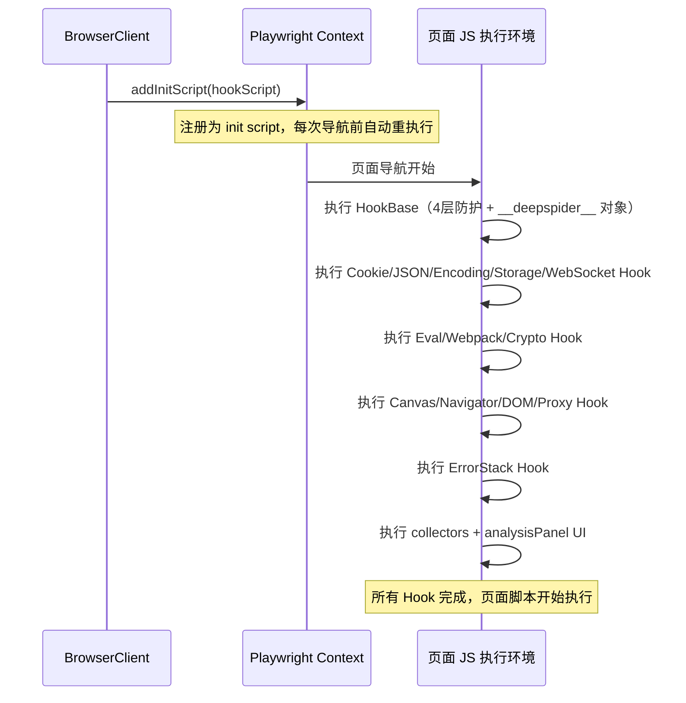
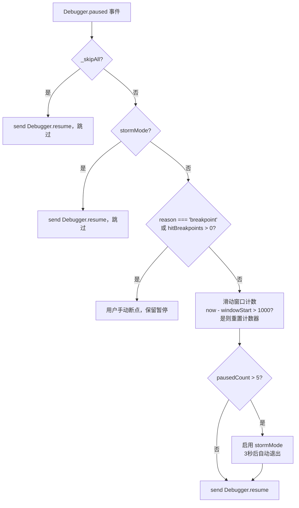
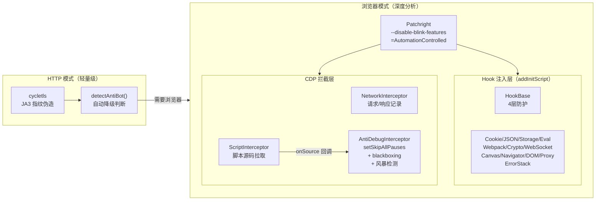

# DeepSpider 反检测与安全机制

本文档完整描述 DeepSpider 在浏览器自动化、Hook 注入和 HTTP 请求三个层面的反检测体系。

---

## 1. 浏览器层反检测

### 1.1 Patchright vs Playwright

DeepSpider 使用 `patchright` 而非标准 `playwright`。Patchright 是专为反检测优化的 Playwright fork，在 Chromium 层面修补了多处自动化特征，核心差异体现在：

- 修复 `navigator.webdriver` 属性暴露问题（标准 Playwright 会将此属性置为 `true`）
- 修补 CDP 连接特征，使浏览器行为更接近真实用户启动的 Chrome

导入方式（`src/browser/client.js` 第 6 行）：

```javascript
import { chromium } from 'patchright';
```

### 1.2 Chrome 启动参数

`BrowserClient.launch()` 固定传入以下参数：

```javascript
args: [
  '--disable-blink-features=AutomationControlled',
  '--disable-web-security',
  '--ignore-certificate-errors',
  ...args,  // 调用方可追加额外参数
]
```

`--disable-blink-features=AutomationControlled` 是最关键的一项，它阻止 Blink 引擎向网页暴露 `navigator.webdriver = true` 这一自动化特征标志。

### 1.3 HTTPS 证书

无论是临时模式还是持久化模式，都设置了 `ignoreHTTPSErrors: true`，避免因自签名证书导致页面加载失败或触发额外的浏览器警告行为。

### 1.4 持久化上下文

通过 `userDataDir` 启动时调用 `chromium.launchPersistentContext()`，保留 Cookie、LocalStorage、浏览器指纹数据，使后续访问与真实用户的二次登录行为一致。

---

## 2. Hook 注入反检测（4 层防护）

Hook 基础框架在 `src/env/HookBase.js` 中实现，通过 `context.addInitScript()` 注入到每个页面的最早执行阶段（早于任何页面脚本）。4 层防护全部在 `HookBase.getBaseCode()` 中完成。

### 2.1 第 1 层：`Function.prototype.toString` 伪装

反爬脚本常通过 `fn.toString()` 检测函数是否被替换——若结果不以 `function xxx() { [native code] }` 开头，则判定为被 Hook。

**实现方式**（`HookBase.js` 第 20-25、585-591 行）：

```javascript
const originalToString = Function.prototype.toString;
const hookedFns = new WeakMap();

// 注册 Hook 时存入 WeakMap
hookedFns.set(hooked, origStr);  // origStr = originalToString.call(original)

// 拦截 toString
Function.prototype.toString = function() {
  return hookedFns.has(this) ? hookedFns.get(this) : originalToString.call(this);
};
// toString 自身也注册到 WeakMap，防止被检测
hookedFns.set(Function.prototype.toString, originalToString.call(originalToString));
```

关键点：用 `WeakMap` 代替属性标记，不修改函数对象自身，不留任何可枚举痕迹。

### 2.2 第 2 层：`Object.getOwnPropertyDescriptor` 干净描述符

反爬脚本会通过 `Object.getOwnPropertyDescriptor(obj, 'fetch')` 检查属性描述符，若发现非标准的 `writable/enumerable/configurable` 组合则怀疑被 Hook。

**实现方式**（`HookBase.js` 第 593-609 行）：

```javascript
Object.getOwnPropertyDescriptor = function(obj, prop) {
  const desc = origGetDesc.call(Object, obj, prop);
  // 如果该属性的值是已被 Hook 的函数，返回干净的标准描述符
  if (desc && typeof desc.value === 'function' && hookedFns.has(desc.value)) {
    return {
      value: desc.value,
      writable: true,
      enumerable: false,
      configurable: true
    };
  }
  return desc;
};
hookedFns.set(Object.getOwnPropertyDescriptor, originalToString.call(origGetDesc));
```

### 2.3 第 3 层：`Object.keys` / `getOwnPropertyNames` 属性隐藏

防止反爬脚本通过枚举 `window` 对象属性发现 `__deepspider__` 等内部标识。

**实现方式**（`HookBase.js` 第 612-635 行）：

```javascript
const hiddenProps = ['__deepspider__', '__deepspider_hooked__'];

Object.keys = function(obj) {
  const keys = origKeys.call(Object, obj);
  if (obj === window) {
    return keys.filter(k => !hiddenProps.includes(k));
  }
  return keys;
};

Object.getOwnPropertyNames = function(obj) {
  const names = origNames.call(Object, obj);
  if (obj === window) {
    return names.filter(n => !hiddenProps.includes(n));
  }
  return names;
};
```

过滤仅在 `obj === window` 时生效，不影响其他对象的枚举行为。

### 2.4 第 4 层：`Error.prototype.stack` 栈帧过滤

通过调用栈分析检测 Hook 是已知的对抗手段。DeepSpider 在 `getErrorStackHooks()`（`defaultHooks.js` 第 1353-1382 行）中注入栈帧过滤：

```javascript
Object.defineProperty(Error.prototype, 'stack', {
  get: function() {
    let stack = origGet.call(this);
    if (stack && typeof stack === 'string') {
      stack = stack.split('\n').filter(function(line) {
        return !/__deepspider__|DeepSpider|deepspider\.native/.test(line);
      }).join('\n');
    }
    return stack;
  },
  configurable: true
});
```

过滤规则：删除包含 `__deepspider__`、`DeepSpider`、`deepspider.native` 的所有栈帧，使 Hook 调用链对目标网站完全不可见。

### 2.5 防护开关

4 层防护均可通过配置项独立关闭（`HookBase.js` config 对象）：

| 配置项 | 默认值 | 控制的防护 |
|--------|--------|-----------|
| `protectToString` | `true` | 第 1 层 toString 伪装 |
| `protectDescriptor` | `true` | 第 2 层描述符净化 |
| `protectKeys` | `true` | 第 3 层属性隐藏 |

第 4 层（栈帧过滤）始终注入，不受配置控制。

### 2.6 Hook 注入流程



---

## 3. 反反调试（AntiDebugInterceptor）

源文件：`src/browser/interceptors/AntiDebugInterceptor.js`

反调试网站通常通过在 `setInterval` 或 `eval` 中反复触发 `debugger` 语句制造暂停风暴，阻止开发者分析代码。`AntiDebugInterceptor` 通过 CDP 协议在引擎级别拦截这一行为。

### 3.1 主策略：`setSkipAllPauses`

启动时立即执行：

```javascript
await this.client.send('Debugger.setSkipAllPauses', { skip: true });
this._skipAll = true;
```

`Debugger.setSkipAllPauses(true)` 告知 V8 引擎完全忽略所有 `debugger` 语句，零运行时开销，且不修改源码，不触发 SRI 完整性校验。

### 3.2 辅助策略：脚本 blackboxing

ScriptInterceptor 拉取脚本源码后回调 `AntiDebugInterceptor.checkScript()`：

```javascript
checkScript(scriptId, scriptSource) {
  if (/\bdebugger\b/.test(scriptSource)) {
    this.client.send('Debugger.setBlackboxedRanges', {
      scriptId,
      positions: [{ lineNumber: 0, columnNumber: 0 }],
    });
    this.blackboxedScripts.add(scriptId);
  }
}
```

对含有 `debugger` 关键字的脚本，从第 0 行第 0 列开始 blackbox 整个脚本，使调试器跳过该脚本内所有断点。

注意：`/\bdebugger\b/` 会匹配字符串和注释中的 `debugger`，导致误 blackbox，但在反爬场景下可接受——被误 blackbox 的脚本仍正常执行，只是不可调试。

### 3.3 风暴检测算法

当用户主动设置断点时，需调用 `enablePauses()` 关闭 skipAllPauses。此时启用辅助的风暴检测防线：

**参数（`AntiDebugInterceptor` 构造函数）：**

| 参数 | 值 | 含义 |
|------|----|------|
| `PAUSED_WINDOW_MS` | 1000 ms | 滑动检测窗口大小 |
| `PAUSED_THRESHOLD` | 5 次 | 窗口内超过此次数视为风暴 |
| 风暴模式自动退出（自动触发）| 3000 ms | 自动检测触发后的持续时间 |
| 风暴模式自动退出（手动触发）| 5000 ms | `setStormMode(true)` 后的持续时间 |

**算法流程：**



### 3.4 手动断点豁免

在 `skipAll = false` 且非风暴模式时，`reason === 'breakpoint'` 或 `hitBreakpoints.length > 0` 的暂停事件会直接返回，不触发自动 resume，使用户设置的手动断点正常生效。

### 3.5 初始化顺序

在 `BrowserClient.setupPage()` 中，拦截器的启动顺序是固定的：

```javascript
await networkInterceptor.start();   // 1. 网络拦截
await scriptInterceptor.start();    // 2. 脚本拦截（启用 Debugger 域）
await antiDebugInterceptor.start(); // 3. 反调试（依赖 Debugger 域已启用）
```

`AntiDebugInterceptor` 必须在 `ScriptInterceptor` 之后启动，因为 `Debugger.enable` 由后者负责，`setSkipAllPauses` 要求 Debugger 域已处于启用状态。

---

## 4. 内部数据隔离

Hook 监控所有页面的 JSON 序列化、Storage 读写等操作，若不加以过滤，DeepSpider 自身的前后端通信数据将被误记录进 Hook 日志，造成干扰。系统通过两套约定解决此问题。

### 4.1 `__ds__: true` 协议

用于 JSON 序列化场景。`JSON.parse` / `JSON.stringify` Hook 在处理前检查标记（`defaultHooks.js` 第 235、251 行）：

```javascript
const INTERNAL_MARKER = '"__ds__":true';

// parse Hook
if (textStr.length >= MIN_LOG_LENGTH && !textStr.includes(INTERNAL_MARKER)) {
  deepspider.log('json', { ... });
}

// stringify Hook
if (result && result.length >= MIN_LOG_LENGTH && !result.includes(INTERNAL_MARKER)) {
  deepspider.log('json', { ... });
}
```

凡是包含 `"__ds__":true` 字段的 JSON 字符串，均被跳过，不记录到日志。

**适用场景：**

```javascript
// 前端发送给后端的消息
const msg = { __ds__: true, type: 'chat', text: '...' };
window.__deepspider_send__(JSON.stringify(msg));  // 不触发 Hook 记录

// 面板消息对象
{ __ds__: true, role: 'user', content: '...' }
```

### 4.2 `deepspider_` 前缀约定

用于 Storage 操作场景。Storage Hook 在读写前检查 key 前缀（`defaultHooks.js` 第 348、357、365 行）：

```javascript
const INTERNAL_PREFIX = 'deepspider_';

storage.getItem = function(key) {
  const value = origGet(key);
  if (!key.startsWith(INTERNAL_PREFIX)) {
    deepspider.log('storage', { ... });
  }
  return value;
};

storage.setItem = function(key, value) {
  if (!key.startsWith(INTERNAL_PREFIX)) {
    deepspider.log('storage', { ... });
  }
  return origSet(key, value);
};
```

以 `deepspider_` 开头的 key 完全透明，不产生任何日志条目。

**示例：**

```javascript
sessionStorage.setItem('deepspider_messages', data);  // 不触发 Hook
sessionStorage.setItem('deepspider_chat_state', '{}'); // 不触发 Hook
sessionStorage.setItem('user_token', 'abc');           // 正常记录
```

### 4.3 完整过滤规则汇总

| 场景 | 过滤机制 | 触发判断 |
|------|----------|----------|
| `JSON.stringify` / `JSON.parse` | `"__ds__":true` 字段 | 字符串包含该子串即跳过 |
| `localStorage.getItem/setItem` | `deepspider_` 前缀 | key 以此前缀开头即跳过 |
| `sessionStorage.getItem/setItem` | `deepspider_` 前缀 | key 以此前缀开头即跳过 |
| CDP binding 消息（`__deepspider_send__`）| 协议层隔离 | 通过 CDP binding 传输，不经过 JS 层 Hook |

---

## 5. TLS 指纹伪装

源文件：`src/agent/tools/http/fetch.js`

轻量级 HTTP 模式（`http_fetch` 工具）使用 `cycletls` 库在 TCP 握手层面伪造 TLS ClientHello，绕过基于 JA3 指纹的反爬检测。

### 5.1 JA3 指纹预设

系统内置三种浏览器指纹：

**Chrome 120**

```
ja3: 771,4865-4866-4867-49195-49199-49196-49200-52393-52392-49171-49172-156-157-47-53,
     0-23-65281-10-11-35-16-5-13-18-51-45-43-27-17513,29-23-24,0
ua:  Mozilla/5.0 (Windows NT 10.0; Win64; x64) AppleWebKit/537.36 (KHTML, like Gecko)
     Chrome/120.0.0.0 Safari/537.36
```

**Firefox 121**

```
ja3: 771,4865-4867-4866-49195-49199-52393-52392-49196-49200-49162-49161-49171-49172-
     156-157-47-53,0-23-65281-10-11-35-16-5-34-51-43-13-45-28-21,29-23-24-25-256-257,0
ua:  Mozilla/5.0 (Windows NT 10.0; Win64; x64; rv:121.0) Gecko/20100101 Firefox/121.0
```

**Safari 17.2**

```
ja3: 771,4865-4866-4867-49196-49195-52393-49200-49199-52392-49162-49161-49172-49171-
     157-156-53-47,0-23-65281-10-11-16-5-13,29-23-24-25,0
ua:  Mozilla/5.0 (Macintosh; Intel Mac OS X 10_15_7) AppleWebKit/605.1.15 (KHTML, like Gecko)
     Version/17.2 Safari/605.1.15
```

### 5.2 请求构造

每次请求时，JA3 和 User-Agent 同时生效，保持一致性：

```javascript
const response = await cycleTLS(url, {
  method,
  headers: {
    'User-Agent': fingerprint.ua,
    'Accept': 'text/html,application/xhtml+xml,application/xml;q=0.9,*/*;q=0.8',
    'Accept-Language': 'en-US,en;q=0.9',
    'Accept-Encoding': 'gzip, deflate, br',
    ...headers
  },
  body,
  ja3: fingerprint.ja3,
  proxy: process.env.PROXY_URL
}, 'get');
```

调用方可通过 `headers` 参数覆盖默认请求头，也可通过环境变量 `PROXY_URL` 指定代理。

### 5.3 反爬自动检测与降级

响应返回后，`detectAntiBot()` 函数检查多个反爬指标：

```javascript
const indicators = [
  response.status === 403,
  response.status === 429,
  response.status === 503,
  response.headers?.server?.toLowerCase().includes('cloudflare'),
  response.headers?.server?.toLowerCase().includes('ddos-guard'),
  response.body?.includes('challenge-platform'),
  response.body?.includes('cf-browser-verification'),
  response.body?.includes('captcha'),
  response.body?.includes('Access Denied')
];
return indicators.filter(Boolean).length >= 2;  // 满足2项即判定为反爬
```

当 `needsBrowser = true` 时，工具在返回结果中提示调用方切换到浏览器模式（Patchright），由主 Agent 决策后续处理方式。

### 5.4 两种模式的选择原则

| 维度 | HTTP 模式（cycletls） | 浏览器模式（Patchright） |
|------|----------------------|------------------------|
| 速度 | < 100 ms | 数秒（启动 + 渲染） |
| TLS 指纹 | 可伪造 JA3 | 真实 Chrome 指纹 |
| JS 执行 | 不执行 | 完整执行 |
| 动态内容 | 不支持 | 支持 |
| 验证码 | 无法处理 | 可集成处理 |
| 适用场景 | 简单接口、静态页面 | SPA、强反爬、验证码 |

---

## 6. 各机制协作总览


